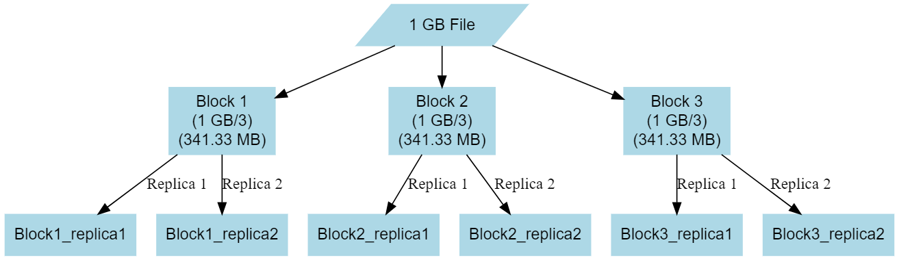

### The Hadoop Ecosystem
   
##### HDFS Hadoop Distributed File System :  

Hadoop Distributed File System (HDFS) differs from traditional filesystems in that it's typically not directly mounted for user viewing in the conventional sense. Instead, HDFS offers shell commands and a Java API that resemble those of other file systems. Designed to be distributed, scalable, and portable, HDFS is a Java-based filesystem specifically tailored for the Hadoop framework.
Data Blocks

HDFS is designed to support very large files. Applications that are compatible with HDFS are those that deal with large data sets. These applications write their data only once but they read it one or more times and require these reads to be satisfied at streaming speeds. HDFS supports write-once-read-many semantics on files. A typical block size used by HDFS is 64 MB, 128MB, 256MB and so on ... Thus, an HDFS file is chopped up into 64 MB chunks, and if possible, each chunk will reside on a different DataNode.
Theoretical illustration   

  

HDFS, the Hadoop Distributed File System, consists of two key components: the NameNode and the DataNode. The NameNode holds essential metadata about the filesystem, including file names, permissions, and block locations. It acts as the central authority in HDFS. DataNodes, on the other hand, store the actual data blocks and rely on the NameNode for metadata information. Without the NameNode, DataNodes cannot serve data to clients effectively.  

  

